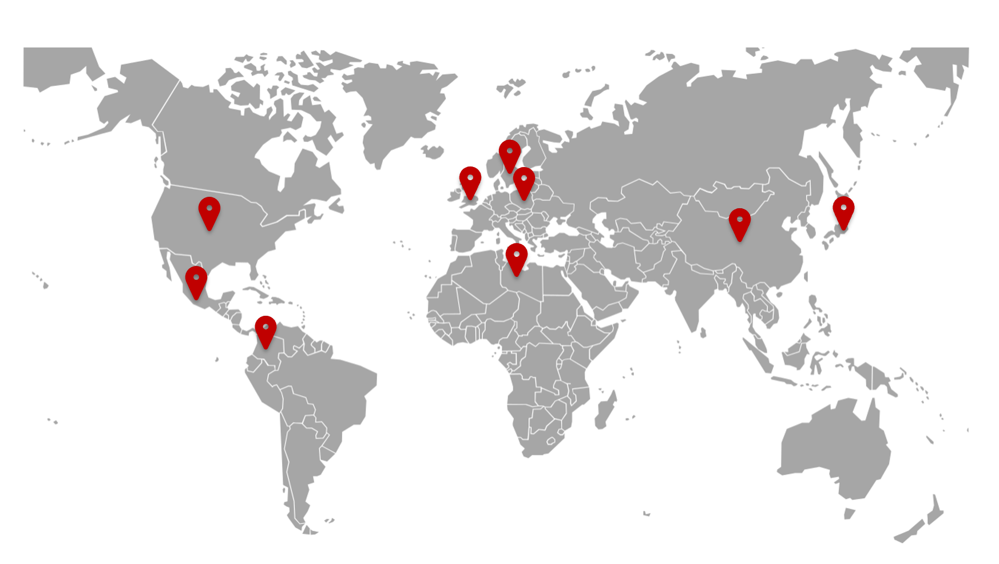
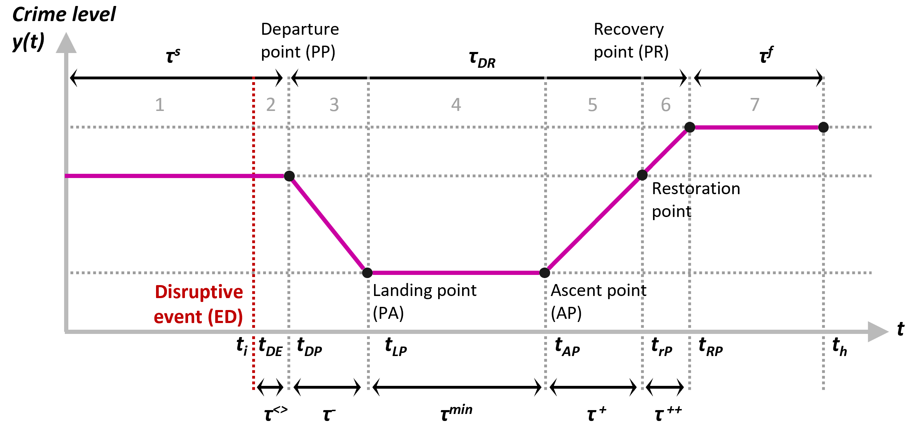

# Resilience of criminogenic systems during the COVID-19 crisis

Our team support police forces in adapting their strategies during the COVID crisis. Our work is underpinned by a social-ecological resilience framework and computational tools grounded in data science. In practice, we adopt a collaborative, problem-oriented approach to generate evidence and understand:
- [x] how crime is evolving during the COVID-19 crisis,
- [x] what problems police should focus on,
- [x] where police presence should be concentrated.

### Latest Update

- December 2020: Presentation, National Police of Colombia
 

### Global Monitor

### Resilience Framework

Borrion, H., Kurland, J., Tilley, N., & Chen, P. (2020). Measuring the resilience of criminogenic ecosystems to global disruption: A case-study of COVID-19 in China. Plos one, 15(10) [Open Access](https://journals.plos.org/plosone/article?id=10.1371/journal.pone.0240077)

### Partners

- People's Public Security University of China
- [National Police of Colombia](https://www.policia.gov.co/)
- [Global Initiative](https://globalinitiative.net/)
- [National Police Agency (Japan)](http://www.npa.go.jp)
- [Malta Police Force](https://pulizija.gov.mt/)

### Contact 
- [@criminexus](https://twitter.com/criminexus?lang=en)
- h.borrion@ucl.ac.uk
